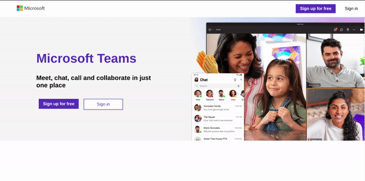

# Microsoft Teams Clone




## Index

1. [Introduction](#Introduction)
2. [Documentation](#Documentation)
3. [How to use](#How_to_Use)

### Introduction

A simple microsoft teams clone, which allow users to connect over video calls and chats.

### Documentation

To read about how I planned and implemented the project, refer [this](./DOC/README.md)

### How to Use

Clone this repository

```shell
git clone https://github.com/chetanpandey1266/microsoft-clone.git
```

Move to the repository's root folder

```shell
cd microsoft-clone
```

##### For running the react app

Get to the root folder and type this:

```shell
cd microsoft-frontend
npm install
npm start
```

##### For running the express app

Get to the root folder.

Open the `config/defualt.json` file and fill in all the configuration details

Note: Switch on [Less Secure App](https://accounts.google.com/signin/v2/challenge/pwd?continue=https%3A%2F%2Fmyaccount.google.com%2Flesssecureapps&service=accountsettings&osid=1&rart=ANgoxcdbq_k-DdEfD8NowR_H2bUXewvuFAFrbZQUj4FzcLbco89A9pfFUk0Hq0qJqSxCxKxFhodvlg2a-PbEbGOYtS-fNe8WYw&TL=AM3QAYZUHLr8-GRHwbAzraWjtYwa7Yk2xGUDGE-hB_RDq4UWvFPgc9LoOKrByFWZ&flowName=GlifWebSignIn&cid=1&flowEntry=ServiceLogin) for the above email.

```shell
npm install
npm start
```

Note: You should have two terminal instances for running frontend and backend simulataneously.
